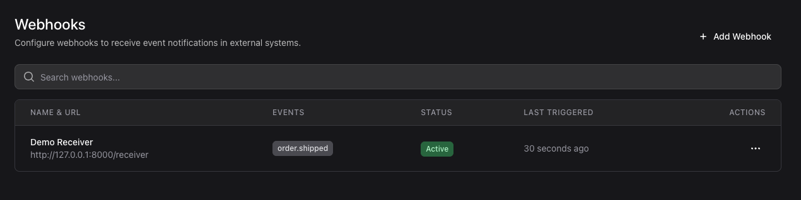

# Laravel Config Webhook

[](https://packagist.org/packages/cleaniquecoders/laravel-config-webhook) [](https://github.com/cleaniquecoders/laravel-config-webhook/actions?query=workflow%3Arun-tests+branch%3Amain) [](https://packagist.org/packages/cleaniquecoders/laravel-config-webhook)

Define, sign, dispatch and log **outgoing webhooks** in any Laravel app. Subscribers
register a URL, a secret, and the event types they care about; when one of those events
fires, the package delivers an **HMAC-signed** JSON payload with automatic **retries and
exponential backoff**, and records every attempt in a delivery log. Ships with an
**optional Livewire + [Flux](https://fluxui.dev) admin UI**.

The package is completely app-agnostic — it knows nothing about your domain. You register
your own event catalogue (via config or at runtime) and either dispatch payloads manually
or map your domain events to webhook types.



## Features

- 🔌 **Outgoing webhooks** — per-subscriber URL, secret, subscribed events, custom headers
- 🔏 **HMAC-SHA256 signatures** — every request is signed; helpers to verify incoming ones too
- 🔁 **Retries with exponential backoff** — configurable base/multiplier, full delivery log
- 🧾 **Delivery logs** — status, HTTP code, response time, attempt, error, response body
- 🧩 **Config- or runtime-driven event catalogue** — no hardcoded domain events
- 🖥️ **Optional Livewire + Flux admin UI** — works headless without it
- 🔐 **Secrets encrypted at rest**, configurable authorization gate, configurable user model
- ✅ Laravel **12 & 13**, PHP 8.3+

## Requirements

- PHP **8.3+**
- Laravel **12** or **13**
- (Optional, for the admin UI) `livewire/livewire` **^3 || ^4** and `livewire/flux`

## Installation

```bash
composer require cleaniquecoders/laravel-config-webhook
```

The service provider and `ConfigWebhook` facade are auto-discovered — no manual
registration needed.

Publish and run the migrations:

```bash
php artisan vendor:publish --tag="laravel-config-webhook-migrations"
php artisan migrate
```

Publish the config:

```bash
php artisan vendor:publish --tag="laravel-config-webhook-config"
```

Optionally publish the views (to customise the Flux UI):

```bash
php artisan vendor:publish --tag="laravel-config-webhook-views"
```

> The optional admin UI requires `livewire/livewire` and `livewire/flux`. The service,
> job, and signing all work without them.

## Configuration

Register the event types your app can emit, either in `config/config-webhook.php`:

```php
'events' => [
    'order.created'   => 'Order Created',
    'order.cancelled' => 'Order Cancelled',
    'user.registered' => 'User Registered',
],
```

…or at runtime (e.g. in a service provider's `boot()`):

```php
use CleaniqueCoders\ConfigWebhook\Facades\ConfigWebhook;

ConfigWebhook::registerEvents([
    'order.created' => 'Order Created',
    'user.registered' => 'User Registered',
]);
```

## Usage

### 1. Dispatch a payload manually

Fan a payload out to every active webhook subscribed to the event type:

```php
use CleaniqueCoders\ConfigWebhook\Facades\ConfigWebhook;

ConfigWebhook::send('order.created', [
    'id' => $order->id,
    'total' => $order->total,
]);
```

The receiver gets:

```jsonc
// POST https://subscriber.example.com/hook
// Headers: X-Webhook-Signature, X-Webhook-Event, X-Webhook-Delivery
{
    "event": "order.created",
    "timestamp": "2026-06-08T12:00:00+00:00",
    "data": { "id": 123, "total": 49.90 }
}
```

### 2. Map a domain event (auto-dispatch)

Wire a domain event to a webhook type once and the package dispatches automatically
whenever the event fires:

```php
use App\Events\OrderCreated;
use CleaniqueCoders\ConfigWebhook\Facades\ConfigWebhook;

ConfigWebhook::listen(
    OrderCreated::class,
    'order.created',
    fn (OrderCreated $event) => [
        'id' => $event->order->id,
        'total' => $event->order->total,
    ],
);
```

### 3. Verifying signatures on the receiving side

```php
use CleaniqueCoders\ConfigWebhook\Support\WebhookSignature;

$valid = WebhookSignature::verify(
    payload: $request->getContent(),
    signature: $request->header('X-Webhook-Signature'),
    secret: $sharedSecret,
);
```

### Admin UI

Enable the bundled full-page route in `config/config-webhook.php`:

```php
'route' => [
    'enabled' => true,
    'prefix' => 'admin/webhooks',
    'name' => 'config-webhook.index',
    'middleware' => ['web', 'auth'],
],
```

Or drop the Livewire component anywhere in your own layout:

```blade
<livewire:config-webhook.webhooks />
```

Restrict access with a gate:

```php
'gate' => 'manage-webhooks', // ability string, or a fn ($user) => bool
```

### Pruning logs

```bash
php artisan config-webhook:prune --days=30
```

## How it works

| Concern | Class |
|---|---|
| Manager (facade root) | `ConfigWebhook` — `registerEvent(s)`, `listen`, `send`, `dispatchFromEvent` |
| Models | `Models\Webhook`, `Models\WebhookDeliveryLog` (package `Concerns\HasUuid`) |
| Status | `Enums\DeliveryStatus` — `PENDING`, `SUCCESS`, `FAILED`, `RETRYING` |
| Delivery | `Jobs\SendWebhookEvent` (queued, retry + backoff) |
| Signing | `Support\WebhookSignature` — `generate` / `verify` |
| Events | `Events\WebhookDelivered`, `Events\WebhookFailed` |
| CLI | `Commands\PruneWebhookDeliveryLogsCommand` |
| UI | `Livewire\Webhooks` + `resources/views/livewire/webhooks.blade.php` (Flux, optional) |

## Testing

```bash
composer test
```

The suite includes a true **end-to-end test** (`tests/EndToEndTest.php`) that mirrors how a
consuming app uses the package: a domain event is mapped with `ConfigWebhook::listen()`, a
subscriber webhook is created, the event is fired, and the queued job runs on the **sync**
queue to deliver a signed HTTP request — asserting both the outgoing request and the
recorded delivery log.

## Local development (try it in a real app)

The package ships an [Orchestra Testbench **Workbench**](https://github.com/orchestral/testbench)
setup (`testbench.yaml` + `workbench/`) — a real Laravel app, pre-seeded so it works
end-to-end out of the box:

```bash
composer install
vendor/bin/testbench migrate:fresh --seed              # tables + a seeded "Demo Receiver" webhook
vendor/bin/testbench serve --port=8000                 # terminal 1 — http://127.0.0.1:8000
vendor/bin/testbench queue:work --queue=webhooks --tries=1   # terminal 2 — delivery is async
```

Then exercise the full pipeline:

- `GET /webhooks` — the bundled Livewire admin UI (needs `livewire/flux` installed to render)
- `GET /fire` — dispatches the sample `OrderShipped` domain event
- `GET /received` — the in-app subscriber endpoint shows the **signed** payload it received
  (`"verified": true`), and the delivery log in the UI shows `status=success, http=200`

`workbench/app/Providers/WorkbenchServiceProvider.php` shows exactly how a host app registers
its event catalogue and maps a domain event to a webhook type;
`workbench/routes/web.php` includes a `/receiver` endpoint that verifies the HMAC signature.

> The demo delivers on a `database` queue, so a `queue:work` worker must be running. In your
> own app you can deliver synchronously by setting the queue connection to `sync`.

## Documentation

Full documentation lives in [`docs/`](docs/README.md):

- [Architecture](docs/01-architecture/README.md) — how it works, components, delivery lifecycle
- [Development](docs/02-development/README.md) — getting started, usage, testing, workbench
- [Configuration](docs/03-configuration/01-reference.md) — every config key
- [API Reference](docs/04-api/README.md) — manager, signatures, payload & headers
- [Releasing](docs/05-releasing/README.md) — versioning and publishing

## Changelog

Please see [CHANGELOG](CHANGELOG.md) for more information on what has changed recently.

## Credits

- [Nasrul Hazim Bin Mohamad](https://github.com/nasrulhazim)
- [All Contributors](../../contributors)

This package was extracted and generalised from the G8Stack webhook integrations feature.

## License

The MIT License (MIT). Please see [License File](LICENSE.md) for more information.
