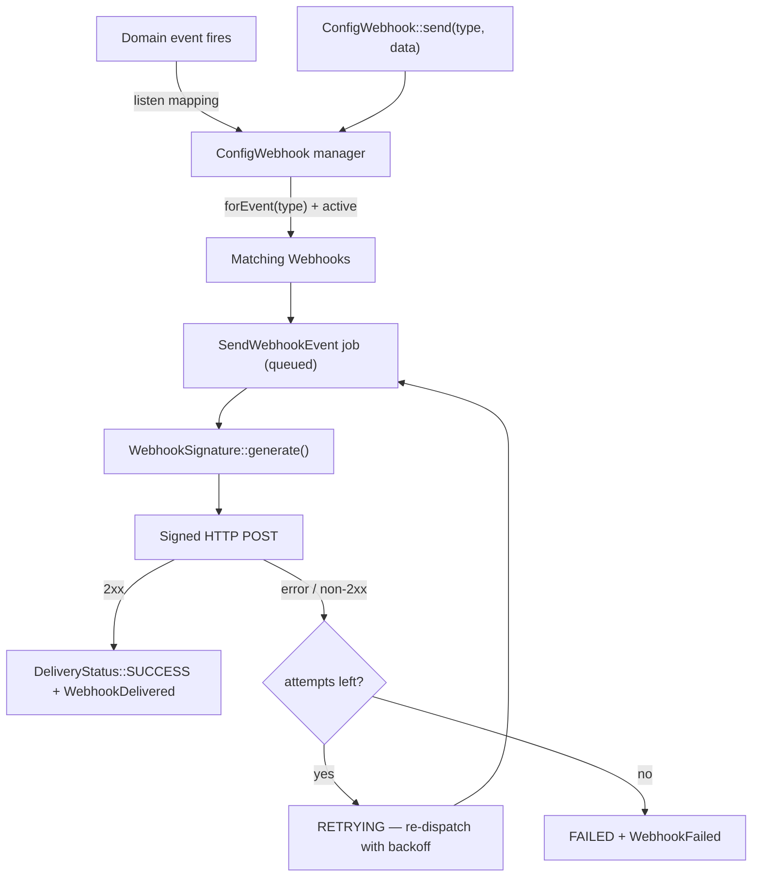

# Architecture Overview

`laravel-config-webhook` delivers **outgoing** webhooks. Subscribers register a URL, a secret,
and the event types they care about. When one of those events fires, the package sends an
HMAC-signed JSON payload to every active subscriber, retries on failure with exponential
backoff, and records every attempt.

## The core idea

The package has **no built-in event map**. The host owns the catalogue of event types and wires
them up in one of two ways.

### 1. Dispatch manually

Fan a payload out to every active webhook subscribed to a type:

```php
use CleaniqueCoders\ConfigWebhook\Facades\ConfigWebhook;

ConfigWebhook::send('order.created', ['id' => $order->id]);
```

### 2. Map a domain event

Wire a Laravel event to a webhook type once; the package auto-dispatches whenever it fires:

```php
ConfigWebhook::listen(
    OrderCreated::class,
    'order.created',
    fn (OrderCreated $event) => ['id' => $event->order->id],
);
```

Both paths converge on the same pipeline: resolve subscribers → queue a
`SendWebhookEvent` job per webhook → sign → POST → log.

## High-level flow



## Decoupling rules

These keep the package reusable in any app. They are invariants — do not regress them:

1. **No host base model.** Models extend `Illuminate\Database\Eloquent\Model` and use the
   package's own `Concerns\HasUuid` trait.
2. **No hardcoded user model.** The `Webhook::user()` relation resolves via
   `config('config-webhook.user_model')`; `webhooks.user_id` is a plain nullable indexed column
   with **no** DB-level foreign key (the host's users table is unknown).
3. **No built-in event catalogue.** Event types are config- or runtime-registered by the host.
4. **No global helpers.** Signing lives in `Support\WebhookSignature`.
5. **Config-driven authorization.** Access goes through `config('config-webhook.gate')`
   (null = open, string = ability, callable = `fn ($user) => bool`).
6. **Optional UI.** The Livewire component and route register only when `livewire/livewire` is
   installed; the manager, job, and signing all work headless.
7. **Config-driven table names.** Models override `getTable()` and migrations read
   `config('config-webhook.table.*')`.

## Next Steps

- [Components](02-components.md) — the classes behind this flow
- [Delivery Lifecycle](03-delivery-lifecycle.md) — attempt-by-attempt detail
- [Getting Started](../02-development/01-getting-started.md) — install and wire it up
