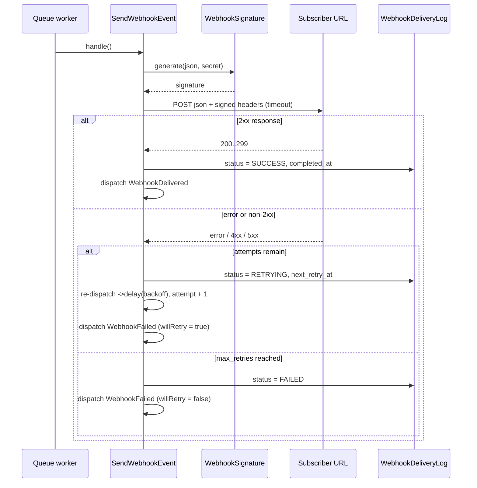

# Delivery Lifecycle

What happens from the moment an event is dispatched to the final `SUCCESS` or `FAILED` log
entry. The delivery engine is `Jobs\SendWebhookEvent`.

## One job per webhook, one try per job

When the manager dispatches an event it resolves every **active** webhook subscribed to that
type and queues **one** `SendWebhookEvent` per webhook. Each job has `$tries = 1` — it makes a
single HTTP attempt and then either finishes or schedules the *next* attempt itself.

> **Why manual retries?** Laravel's built-in `$tries` would re-run the whole job opaquely. By
> owning the retry loop, the package can record each attempt, apply its own backoff, and stop
> exactly at `max_retries`. Do not raise `$tries` above 1 or attempts will be double-counted.

## A single attempt



## Signing

The job serializes the payload to JSON, then signs the **raw JSON body**:

```text
X-Webhook-Signature = HMAC_<algo>(body, webhook.secret)
```

Along with the signature it sends `X-Webhook-Event` (the event type) and `X-Webhook-Delivery`
(the delivery log UUID). Header names and the algorithm are configurable — see
[Payload & Headers](../04-api/03-payload-and-headers.md).

## Recording the attempt

Every attempt updates its `WebhookDeliveryLog` row:

| Field | Meaning |
|---|---|
| `status` | `pending` → `success` / `retrying` / `failed` |
| `response_status` | HTTP status code returned by the subscriber |
| `response_body` | Response body, truncated to `response_body_limit` |
| `response_time_ms` | Round-trip time in milliseconds |
| `attempt` | 1-based attempt number |
| `error_message` | Exception / transport error, if any |
| `next_retry_at` | When the next attempt is scheduled (while `retrying`) |
| `completed_at` | Set on the terminal attempt |

## Exponential backoff

The delay before attempt **N** is:

```text
delay = base * (multiplier ^ (N - 1))
```

With the defaults `base = 10` and `multiplier = 3`, the delays are 10s, 30s, 90s, 270s, …
Both values are configurable under `config('config-webhook.backoff')`.

## Retry termination

Retries stop when `attempt` reaches the webhook's `max_retries` (falling back to
`config('config-webhook.defaults.max_retries')`). The final attempt is marked `FAILED` and
`WebhookFailed` is dispatched with `willRetry = false`.

## Next Steps

- [Components](02-components.md) — the classes involved
- [Configuration](../03-configuration/README.md) — `queue`, `defaults`, `backoff`, `signature`
- [Usage](../02-development/02-usage.md) — trigger deliveries and read logs
