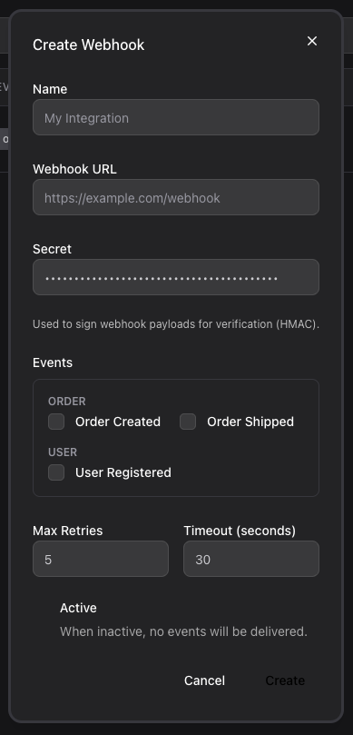
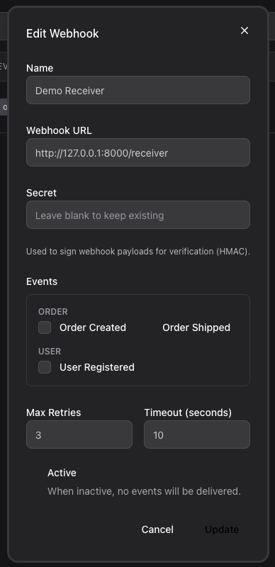
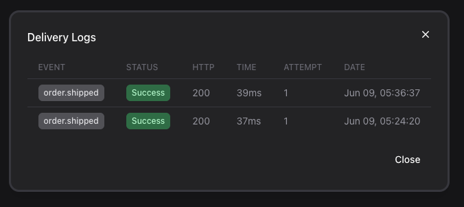

# Usage

The four things you will do with the package: dispatch payloads, map domain events, verify
signatures, and manage the admin UI and logs.

## 1. Dispatch a payload manually

Fan a payload out to every active webhook subscribed to the event type. Returns the number of
webhooks the payload was queued for:

```php
use CleaniqueCoders\ConfigWebhook\Facades\ConfigWebhook;

$count = ConfigWebhook::send('order.created', [
    'id' => $order->id,
    'total' => $order->total,
]);
```

The receiver gets a signed POST — see [Payload & Headers](../04-api/03-payload-and-headers.md).

## 2. Map a domain event (auto-dispatch)

Wire a Laravel event to a webhook type once; the package registers a listener that dispatches
automatically whenever the event fires. The resolver turns the event into the payload `data`:

```php
use App\Events\OrderCreated;
use CleaniqueCoders\ConfigWebhook\Facades\ConfigWebhook;

ConfigWebhook::listen(
    OrderCreated::class,
    'order.created',
    fn (OrderCreated $event) => [
        'id' => $event->order->id,
        'total' => $event->order->total,
    ],
);
```

Put this in a service provider's `boot()`. From then on, `OrderCreated::dispatch(...)` in your
app delivers the webhook with no extra code.

## 3. Verify signatures on the receiving side

A subscriber authenticates a delivery by recomputing the HMAC of the **raw request body** with
the shared secret and comparing it to the signature header:

```php
use CleaniqueCoders\ConfigWebhook\Support\WebhookSignature;

$valid = WebhookSignature::verify(
    payload: $request->getContent(),
    signature: $request->header('X-Webhook-Signature'),
    secret: $sharedSecret,
);

abort_unless($valid, 401);
```

If you only have the manager available, `ConfigWebhook::verifySignature($payload, $signature,
$secret)` does the same thing.

## 4. Admin UI

The bundled UI requires `livewire/livewire` and `livewire/flux`. Enable the full-page route in
`config/config-webhook.php`:

```php
'route' => [
    'enabled' => true,
    'prefix' => 'admin/webhooks',
    'name' => 'config-webhook.index',
    'middleware' => ['web', 'auth'],
],
```

Or drop the Livewire component anywhere in your own layout:

```blade
<livewire:config-webhook.webhooks />
```

Restrict access with a gate (null = open, ability string, or a closure):

```php
'gate' => 'manage-webhooks', // or fn ($user) => $user->isAdmin()
```

### Screenshots

The webhooks list — search, status, last-triggered, and per-row actions:


Creating and editing a webhook (name, URL, secret, subscribed events grouped by prefix, retry
and timeout bounds from `config('config-webhook.defaults')`):





The delivery logs for a webhook — per-attempt status, HTTP code, response time, and attempt
number:



## 5. Prune old delivery logs

```bash
php artisan config-webhook:prune --days=30
```

Schedule it in `routes/console.php` (or the console kernel) to keep the log table tidy:

```php
use Illuminate\Support\Facades\Schedule;

Schedule::command('config-webhook:prune --days=30')->daily();
```

## Next Steps

- [Payload & Headers](../04-api/03-payload-and-headers.md) — exact request shape
- [Manager API](../04-api/01-manager.md) — every method
- [Configuration](../03-configuration/01-reference.md) — queue, retries, signature, gate
